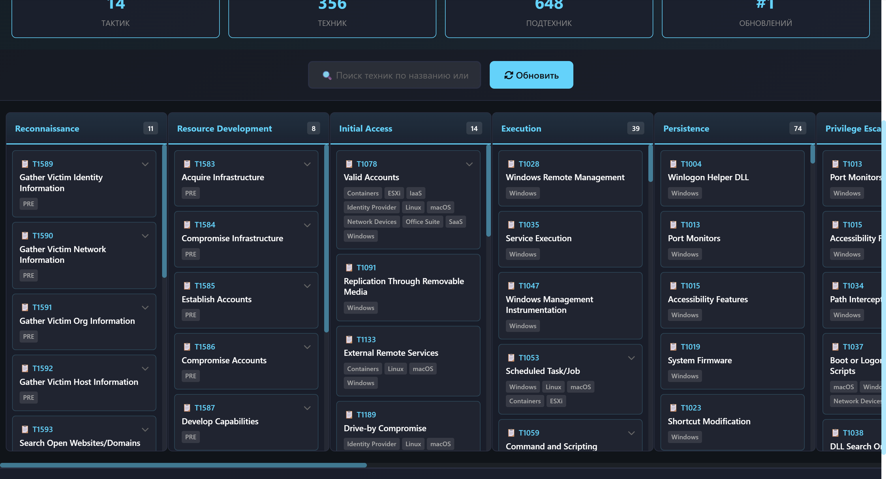
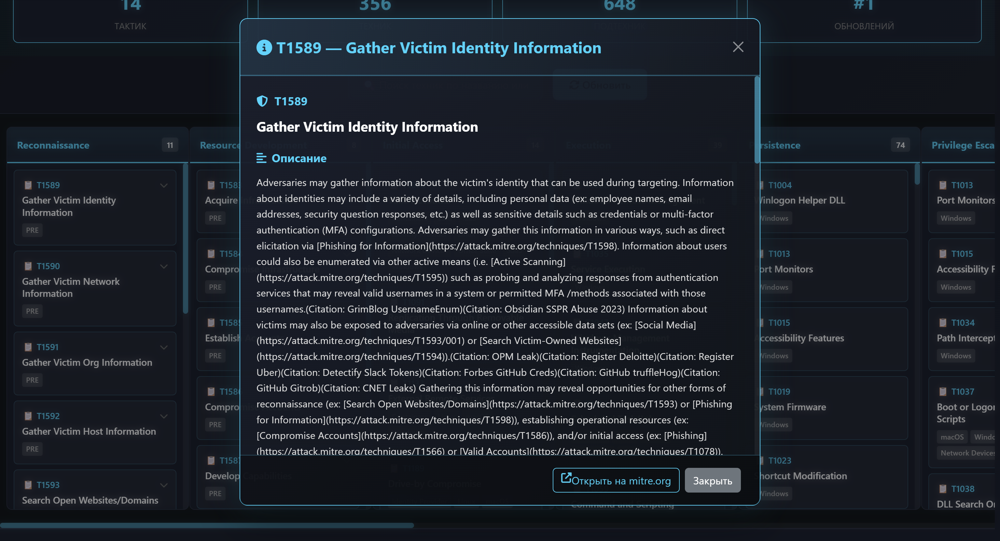
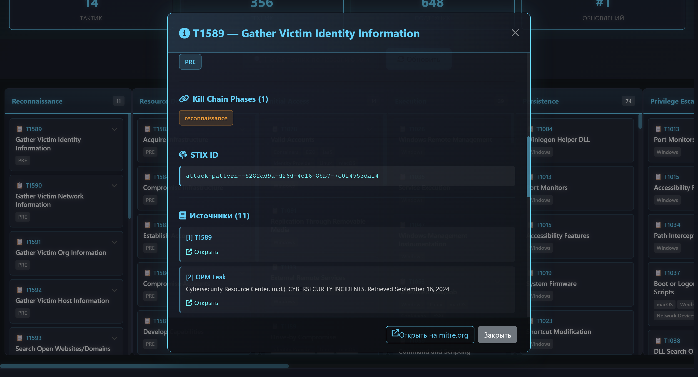

# Просмотрщик матрицы MITRE ATT&CK

Полнофункциональное веб-приложение для просмотра, управления и анализа матрицы MITRE ATT&CK с автоматическим обновлением, интеллектуальным кэшированием и интерактивным пользовательским интерфейсом.

## Скриншоты интерфейса

### Главная страница и матрица тактик



На этом скриншоте отображаются:
- Панель статистики по тактикам, техникам и подтехникам
- Кнопка ручного обновления матрицы
- Выбор интервала автоматического обновления
- Основная матрица тактик MITRE ATT&CK с интерактивными карточками

### Модальное окно техники



Модальное окно отображает:
- ID техники (например, T1001)
- Название техники
- Описание и поддерживаемые платформы
- Ссылку на официальную страницу MITRE ATT&CK
- Блок с методами детекции и дополнительной информацией

### Модальное окно подтехники / расширенные детали



Дополнительное модальное окно демонстрирует расширенные детали техники/подтехники и может включать:
- Подтехники в иерархическом виде
- Дополнительные поля из MITRE (kill chain phase, external references)
- Удобную навигацию по связанным объектам

## Описание

Это приложение предоставляет полную реализацию просмотрщика матрицы MITRE ATT&CK с высокопроизводительным бэкендом на FastAPI и современным отзывчивым фронтендом. Приложение автоматически загружает и кэширует последние данные MITRE ATT&CK из официального репозитория GitHub, обеспечивая быстрый поиск и комплексный анализ техник и тактик атак.

## Основные возможности

- **FastAPI бэкенд** — асинхронный, production-ready API с полной типизацией
- **Интерактивный фронтенд** — современный отзывчивый интерфейс с тёмной темой и плавными анимациями
- **Автоматическое обновление** — настраиваемые интервалы обновления от 1 часа до 7 дней
- **Умное кэширование** — локальное JSON-кэширование для мгновенного доступа к данным
- **Продвинутый поиск** — полнотекстовый поиск по названиям, ID, описаниям и платформам
- **Панель статистики** — точная информация о тактиках, техниках и подтехниках в реальном времени
- **Кроссплатформенность** — безупречная работа на десктопе, планшете и мобильных устройствах
- **Русский язык** — полная поддержка кириллицы и локализации
- **Production-ready** — оптимизировано для развертывания на боевые серверы

## Технологический стек

### Бэкенд
- Python 3.9 и выше
- FastAPI 0.104+ — современный асинхронный веб‑фреймворк с встроенной документацией API
- Uvicorn — ASGI-сервер
- aiohttp — асинхронный HTTP‑клиент для параллельных запросов
- Pydantic — валидация данных с использованием type annotations
- python-dotenv — управление конфигурацией через переменные окружения

### Фронтенд
- HTML5 и CSS3 — семантическая вёрстка и современные стили
- Vanilla JavaScript (ES6+) — чистый JavaScript без зависимостей от фреймворков
- Axios — Promise‑based HTTP‑клиент
- Bootstrap 5 CDN — отзывчивый CSS‑фреймворк
- Font Awesome 6 — богатая иконография

### Источник данных
- MITRE ATT&CK Enterprise Framework — официальный репозиторий с STIX JSON‑форматом

## Установка и запуск

### Необходимые компоненты

Убедитесь, что на вашей системе установлены Python 3.9+ и pip.

### Шаг 1: Клонирование репозитория

```bash
git clone https://github.com/Kelll31/Matrix-MITRE.git
cd Matrix-MITRE
```

### Шаг 2: Создание виртуального окружения

Для Windows:
```bash
python -m venv venv
venv\Scripts\activate
```

Для Linux/macOS:
```bash
python3 -m venv venv
source venv/bin/activate
```

### Шаг 3: Установка зависимостей

```bash
pip install -r requirements.txt
```

### Шаг 4: Запуск приложения

```bash
python main.py
```

Приложение будет доступно по адресу: **http://localhost:8000**

## Спецификация парсинга MITRE данных

### Источник данных

Приложение загружает данные из официального GitHub‑репозитория MITRE ATT&CK:
```
https://raw.githubusercontent.com/mitre-attack/attack-stix-data/master/enterprise-attack/enterprise-attack.json
```

Данные поступают в формате STIX (Structured Threat Information Expression) JSON, который содержит структурированную информацию об атаках.

### Структура исходного STIX JSON

Оригинальный файл содержит объекты следующих типов:

#### 1. Объекты типа `x-mitre-tactic`

Представляют 14 основных тактик MITRE ATT&CK‑матрицы.

**Извлекаемые поля:**
- `name` — полное название тактики (например: "Persistence", "Initial Access")
- `description` — подробное описание тактики и её назначения
- `x_mitre_shortname` — сокращённое имя тактики для использования в URL (например: "persistence", "initial-access")

**Пример исходного объекта:**
```json
{
  "type": "x-mitre-tactic",
  "id": "x-mitre-tactic--...",
  "created": "2018-04-05T20:45:48.005Z",
  "modified": "2020-01-10T16:41:33.561Z",
  "name": "Persistence",
  "description": "The adversary has taken steps to ensure they can maintain their foothold...",
  "x_mitre_shortname": "persistence"
}
```

#### 2. Объекты типа `attack-pattern`

Представляют техники и подтехники атак (разделены флагом `x_mitre_is_subtechnique`).

**Извлекаемые поля для техник (`x_mitre_is_subtechnique = false`):**

| Поле | Тип | Описание | Пример |
|------|-----|---------|--------|
| `name` | string | Название техники | "Data Obfuscation" |
| `description` | string | Подробное описание техники | "Adversaries may obfuscate data..." |
| `x_mitre_platforms` | array | Поддерживаемые платформы | ["Windows", "Linux", "macOS"] |
| `kill_chain_phases` | array | Связанные фазы атаки | [{"phase_name": "command-and-control"}] |
| `external_references` | array | Внешние источники и ID | см. ниже |
| `x_mitre_detection` | string | Методы обнаружения техники | "Monitor for unusual network connections..." |
| `x_mitre_is_subtechnique` | boolean | Флаг подтехники | false |

**Извлекаемые поля для подтехник (`x_mitre_is_subtechnique = true`):**

Те же поля, что и для техник, плюс:
- используют те же `kill_chain_phases` для связи с родительской техникой;
- ID в формате `T1234.001` (родительская техника + номер подтехники).

**Пример исходного объекта техники:**
```json
{
  "type": "attack-pattern",
  "id": "attack-pattern--01a5a209-b94c-450b-b7f9-946ce02218cb",
  "created": "2016-02-19T23:46:38.422Z",
  "modified": "2024-01-10T15:40:22.130Z",
  "name": "Data Obfuscation",
  "description": "Adversaries may obfuscate command and control traffic...",
  "kill_chain_phases": [
    {
      "kill_chain_name": "mitre-attack",
      "phase_name": "command-and-control"
    }
  ],
  "x_mitre_detection": "Monitor for data obfuscation traffic patterns...",
  "x_mitre_is_subtechnique": false,
  "x_mitre_platforms": ["Windows", "Linux", "macOS"],
  "external_references": [
    {
      "source_name": "mitre-attack",
      "url": "https://attack.mitre.org/techniques/T1001/",
      "external_id": "T1001"
    },
    {
      "source_name": "Wikipedia",
      "url": "https://en.wikipedia.org/wiki/Data_obfuscation"
    }
  ]
}
```

**Пример исходного объекта подтехники:**
```json
{
  "type": "attack-pattern",
  "id": "attack-pattern--...",
  "created": "2019-04-25T20:54:15.265Z",
  "modified": "2024-01-10T15:40:22.130Z",
  "name": "Junk Data",
  "description": "Adversaries may add junk data to network packets...",
  "kill_chain_phases": [
    {
      "kill_chain_name": "mitre-attack",
      "phase_name": "command-and-control"
    }
  ],
  "x_mitre_detection": "Monitor for unusual network packet patterns...",
  "x_mitre_is_subtechnique": true,
  "x_mitre_platforms": ["Windows", "Linux", "macOS"],
  "external_references": [
    {
      "source_name": "mitre-attack",
      "url": "https://attack.mitre.org/techniques/T1001/001/",
      "external_id": "T1001.001"
    }
  ]
}
```

### Процесс парсинга в приложении

#### Шаг 1: Загрузка и валидация JSON

```python
async with aiohttp.ClientSession() as session:
    async with session.get(GITHUB_URL) as response:
        text = await response.text()
        data = json.loads(text)
```

#### Шаг 2: Первый проход — сбор тактик

```python
for obj in objects:
    if obj.get("type") == "x-mitre-tactic":
        tactic_name = obj.get("name").lower().replace(" ", "-")
        tactics[tactic_name] = {
            "name": obj.get("name"),
            "description": obj.get("description"),
            "shortname": obj.get("x_mitre_shortname")
        }
        matrix[tactic_name] = []
```

#### Шаг 3: Второй проход — сбор техник и подтехник

```python
for obj in objects:
    if obj.get("type") == "attack-pattern":
        is_subtechnique = obj.get("x_mitre_is_subtechnique", False)
        kill_chain = obj.get("kill_chain_phases", [])
        tactic_names = [kc.get("phase_name", "").lower() for kc in kill_chain]

        external_refs = obj.get("external_references", [])
        external_id = "N/A"
        mitre_url = None

        for ref in external_refs:
            source_name = ref.get("source_name", "").lower()
            if source_name in {"mitre-attack", "attack", "mitre"}:
                external_id = ref.get("external_id", external_id)
                mitre_url = ref.get("url", mitre_url)
                break

        tech_data = {
            "id": external_id,
            "name": obj.get("name", "Unknown"),
            "description": obj.get("description", ""),
            "platforms": obj.get("x_mitre_platforms", []),
            "tactics": tactic_names,
            "mitre_url": mitre_url,
            "detection": obj.get("x_mitre_detection") or "Нет данных о детекции",
            "external_references": formatted_refs,
            "kill_chain_phases": [kc.get("phase_name", "") for kc in kill_chain],
            "stix_id": obj.get("id", "")
        }

        if not external_id.startswith("T"):
            continue

        if is_subtechnique:
            subtechniques[obj.get("id")] = tech_data
        else:
            techniques[obj.get("id")] = tech_data
```

#### Шаг 4: Построение иерархии подтехник

```python
for tech_obj_id, technique in techniques.items():
    technique_subtechniques = []
    for sub_obj_id, subtech in subtechniques.items():
        if subtech["id"].startswith(technique["id"] + "."):
            technique_subtechniques.append(subtech)

    technique["subtechniques"] = sorted(
        technique_subtechniques,
        key=lambda x: x["id"]
    )
```

#### Шаг 5: Создание индексов поиска

```python
for tech_id, tech_data in techniques.items():
    technique_index[tech_data["id"].upper()] = tech_data

for sub_id, sub_data in subtechniques.items():
    subtechnique_index[sub_data["id"].upper()] = sub_data
```

#### Шаг 6: Построение матрицы

```python
for tactic in technique["tactics"]:
    if tactic in matrix:
        matrix[tactic].append(technique_obj)

for tactic_key in matrix:
    matrix[tactic_key].sort(key=lambda x: x["id"])
```

### Структура финального объекта

```json
{
  "tactics": {
    "persistence": {
      "name": "Persistence",
      "shortname": "persistence",
      "description": "..."
    }
  },
  "matrix": {
    "persistence": [
      {
        "id": "T1098",
        "name": "Account Manipulation",
        "description": "...",
        "platforms": ["Windows", "Linux", "macOS"],
        "tactics": ["persistence"],
        "mitre_url": "https://attack.mitre.org/techniques/T1098/",
        "detection": "...",
        "external_references": [...],
        "kill_chain_phases": ["persistence"],
        "subtechniques": [
          {
            "id": "T1098.001",
            "name": "Additional Cloud Credentials",
            "description": "...",
            "platforms": ["AWS", "GCP", "Azure"],
            "tactics": ["persistence"],
            "mitre_url": "https://attack.mitre.org/techniques/T1098/001/",
            "detection": "...",
            "external_references": [...],
            "kill_chain_phases": ["persistence"]
          }
        ]
      }
    ]
  },
  "technique_index": {
    "T1001": {"...": "..."}
  },
  "subtechnique_index": {
    "T1001.001": {"...": "..."}
  },
  "statistics": {
    "total_tactics": 14,
    "total_techniques": 234,
    "total_subtechniques": 543
  }
}
```

### Таблица преобразования полей

| Исходное поле STIX | Поле приложения | Тип | Обработка |
|--------------------|-----------------|-----|----------|
| `type` | — | — | Фильтр для определения типа объекта |
| `name` | `name` | string | Прямое копирование |
| `description` | `description` | string | Копирование или "Описание недоступно" |
| `x_mitre_shortname` | `shortname` | string | Используется для URL‑представления тактики |
| `kill_chain_phases[].phase_name` | `tactics`, `kill_chain_phases` | array | Преобразование в нижний регистр |
| `x_mitre_platforms` | `platforms` | array | Прямое копирование |
| `x_mitre_detection` | `detection` | string | Копирование или "Нет данных о детекции" |
| `x_mitre_is_subtechnique` | — | boolean | Флаг для разделения техник и подтехник |
| `external_references[].source_name` | — | — | Фильтр для поиска MITRE ID |
| `external_references[].external_id` | `id` | string | Извлечение ATT&CK ID (T1234 или T1234.001) |
| `external_references[].url` | `mitre_url` | string | URL на официальную страницу техники |
| `external_references[]` | `external_references` | array | Полное копирование для доступа к источникам |
| `id` | `stix_id` | string | Оригинальный STIX ID (для отладки) |

### Особенности парсинга

1. Все операции парсинга обёрнуты в `try/except` для безопасной обработки ошибок.
2. Все ID техник нормализуются к верхнему регистру для единообразного поиска.
3. Подтехники автоматически связываются с родительскими техниками по префиксу ID.
4. Данные сохраняются в UTF‑8 для полной поддержки кириллицы.
5. Техники без корректного ATT&CK ID (не начинающегося с `T`) отфильтровываются.
6. Создаётся два индекса для O(1) поиска техник и подтехник по ID.
7. Внутри каждой тактики техники и подтехники сортируются по ID.

### Типичные размеры данных

- Всего тактик: 14
- Всего техник: ~234
- Всего подтехник: ~543
- Размер кэша: ~2–3 МБ
- Время парсинга: ~1–2 секунды

## Справка по API

### Endpoints для получения данных

#### Полная матрица
```
GET /api/matrix
```
Возвращает полную матрицу MITRE ATT&CK со всеми тактиками, техниками и подтехниками.

#### Статистика
```
GET /api/statistics
```

Ответ:
```json
{
  "total_tactics": 14,
  "total_techniques": 234,
  "total_subtechniques": 543,
  "last_update": "2026-01-14T12:34:56",
  "update_interval": "24_hours",
  "is_updating": false,
  "update_count": 5
}
```

#### Все тактики
```
GET /api/matrix/tactics
```
Возвращает список всех доступных тактик с описаниями и сокращениями.

#### Детали тактики
```
GET /api/matrix/tactic/{имя_тактики}
```

Пример: `GET /api/matrix/tactic/persistence`

Возвращает все техники, связанные с указанной тактикой.

#### Техника по ID
```
GET /api/matrix/technique/{техника_id}
```

Примеры:
- `GET /api/matrix/technique/T1001`
- `GET /api/matrix/technique/T1001.001`

Возвращает полную информацию о технике или подтехнике, включая описание, поддерживаемые платформы, методы детекции и внешние ссылки.

#### Техники тактики с фильтрацией
```
GET /api/matrix/tactics/{тактика}/techniques
```

Параметры запроса:
- `platform` (опционально) — фильтр по платформе (Windows, Linux, macOS и т.д.)
- `limit` (опционально) — максимальное количество результатов

Пример: `GET /api/matrix/tactics/persistence/techniques?platform=Windows&limit=10`

#### Поиск техник
```
GET /api/search?q={запрос}&limit={лимит}
```

Параметры:
- `q` — строка поиска (обязательно, минимум 1 символ)
- `limit` — максимум результатов (по умолчанию: 20, максимум: 100)

Поиск осуществляется по:
- названиям техник;
- ID техник;
- описаниям;
- поддерживаемым платформам.

Примеры:
- `GET /api/search?q=T1001` — поиск по ID;
- `GET /api/search?q=Process` — поиск по описанию;
- `GET /api/search?q=Windows&limit=50` — поиск по платформе с пользовательским лимитом.

### Endpoints управления и конфигурации

#### Изменение интервала обновления
```
POST /api/settings/update-interval
Content-Type: application/json

{
  "interval": "24_hours"
}
```

Доступные интервалы:
- `1_hour` — обновление каждый час;
- `6_hours` — каждые 6 часов;
- `12_hours` — каждые 12 часов;
- `24_hours` — каждый день (по умолчанию);
- `7_days` — каждую неделю.

#### Немедленное обновление
```
POST /api/matrix/refresh
```

Запускает немедленную загрузку и парсинг последней матрицы MITRE ATT&CK с GitHub. Возвращает подтверждение обновления с временной меткой.

## Интервалы обновления

Приложение поддерживает гибкий график автоматических обновлений для баланса между актуальностью данных и потреблением ресурсов:

| Интервал | Длительность | Применение |
|----------|--------------|------------|
| 1_hour | 3600 секунд | Высокочастотный анализ угроз |
| 6_hours | 21600 секунд | Мониторинг в рабочие часы |
| 12_hours | 43200 секунд | Сбалансированный подход |
| 24_hours | 86400 секунд | Ежедневная синхронизация (рекомендуется) |
| 7_days | 604800 секунд | Низконагруженные окружения |

## Структура проекта

```
Matrix-MITRE/
├── main.py                    # FastAPI-приложение со всеми endpoints
├── requirements.txt           # Зависимости Python
├── README.md                  # Документация проекта
├── .gitignore                 # Конфигурация Git ignore
├── cache/                     # Директория локального кэша (создаётся автоматически)
│   ├── mitre_matrix.json      # Кэшированная матрица MITRE ATT&CK
│   └── metadata.json          # Метаданные и временные метки кэша
├── frontend/                  # Веб-интерфейс
│   └── index.html             # Полный HTML/CSS/JS интерфейс
└── images/                    # Скриншоты интерфейса
    ├── index.png              # Главная страница и матрица тактик
    ├── modal.png              # Модальное окно техники
    └── modal2.png             # Расширенное модальное окно/подтехника
```

## Процесс обновления матрицы

### Инициализация приложения
1. Приложение проверяет наличие локального кэша.
2. Если кэш существует и действителен, данные загружаются немедленно.
3. Если кэш отсутствует или устарел, загрузка происходит с GitHub.
4. Запускается фоновая задача для периодических обновлений.

### Цикл фонового обновления
1. Ожидание настроенного интервала обновления.
2. Загрузка последних данных MITRE ATT&CK в формате STIX JSON.
3. Парсинг и валидация структуры данных.
4. Построение индексов поиска для быстрых ответов.
5. Обновление локальных файлов кэша.
6. Логирование завершения обновления с временной меткой.
7. Увеличение счётчика обновлений.

## Модель данных

Приложение парсит MITRE STIX JSON‑данные в структуру, пригодную для быстрого поиска и отображения в интерфейсе (см. раздел "Спецификация парсинга MITRE данных").

## Характеристики производительности

- начальная загрузка: мгновенная при наличии кэша, 2–5 секунд при первом запуске;
- поиск техники: микросекундный поиск через hash‑индексы;
- производительность поиска: линейный O(n), обычно < 100 мс для ~500 результатов;
- размер кэша: примерно 2–3 МБ для полной матрицы;
- использование памяти: 50–80 МБ во время выполнения;
- одновременные запросы: поддерживается 100+ одновременных пользователей.

## Соображения безопасности

- CORS настроен на принятие запросов со всех источников (для production рекомендуется ограничить);
- все входные данные валидируются через Pydantic‑модели;
- обработка исключений предотвращает утечку внутренней информации;
- в коде не хранятся конфиденциальные учётные данные;
- для конфигурации можно использовать переменные окружения;
- в production‑окружении рекомендуется использовать HTTPS;
- для production можно добавить rate limiting и аутентификацию.

## Развертывание

### Локальная разработка
```bash
python main.py
```

### Production с Gunicorn
```bash
pip install gunicorn
gunicorn main:app --workers 4 --worker-class uvicorn.workers.UvicornWorker --bind 0.0.0.0:8000
```

### Развертывание Docker

```dockerfile
FROM python:3.11-slim

WORKDIR /app

COPY requirements.txt .
RUN pip install --no-cache-dir -r requirements.txt

COPY . .

CMD ["uvicorn", "main:app", "--host", "0.0.0.0", "--port", "8000"]
```

```bash
docker build -t mitre-matrix .
docker run -p 8000:8000 -d mitre-matrix
```

### Сервис Systemd

```ini
[Unit]
Description=MITRE ATT&CK Matrix Service
After=network.target

[Service]
User=www-data
WorkingDirectory=/opt/mitre-matrix
ExecStart=/usr/bin/gunicorn main:app --workers 4 --worker-class uvicorn.workers.UvicornWorker --bind 0.0.0.0:8000
Restart=on-failure

[Install]
WantedBy=multi-user.target
```

```bash
sudo systemctl daemon-reload
sudo systemctl enable mitre-matrix
sudo systemctl start mitre-matrix
```

## Логирование

Приложение выводит подробные логи для мониторинга и отладки:

```
INFO: Application startup complete
INFO: Cache loaded from disk (JSON file)
INFO: MITRE ATT&CK matrix loaded successfully
INFO: Background update task started
INFO: Forcing immediate matrix refresh
INFO: Matrix update completed (update #5)
```

## Обработка ошибок

Приложение возвращает корректные HTTP‑коды и сообщения об ошибках:
- `503 Service Unavailable` — матрица ещё не загружена;
- `404 Not Found` — запрошенная техника или тактика не найдена;
- `429 Too Many Requests` — обновление уже выполняется;
- `400 Bad Request` — неверный параметр интервала обновления.

## Статистика кода

- `main.py`: примерно 650 строк production‑ready Python‑кода;
- `frontend/index.html`: примерно 600 строк HTML/CSS/JavaScript;
- всего: около 1250 строк кода без учёта кэша.

## Последние обновления (v1.1)

- исправлено предупреждение `DeprecationWarning` для устаревшего синтаксиса `@app.on_event`;
- миграция на современный паттерн `lifespan` FastAPI;
- исправлены проблемы с type annotations при валидации ответов;
- улучшена загрузка JSON с GitHub (обработка `text/plain` content‑type);
- реализован полнофункциональный интерактивный фронтенд‑интерфейс;
- улучшена обработка ошибок и логирование.

## Вклад в проект

Вклады приветствуются. Открывайте issues, предлагайте идеи и отправляйте pull‑requests с улучшениями, исправлениями и новыми функциями.

## Лицензия

Проект распространяется по лицензии MIT. Подробности см. в файле `LICENSE`.

## Автор

**Kelll31** — специалист по пентестированию и кибербезопасности.

- GitHub: [Kelll31](https://github.com/Kelll31)
- Специализация: операции красной команды, анализ угроз, фреймворк MITRE ATT&CK

---

**Создано с фокусом на надёжность и удобство использования для специалистов по кибербезопасности.**

Последнее обновление: 14 января 2026
